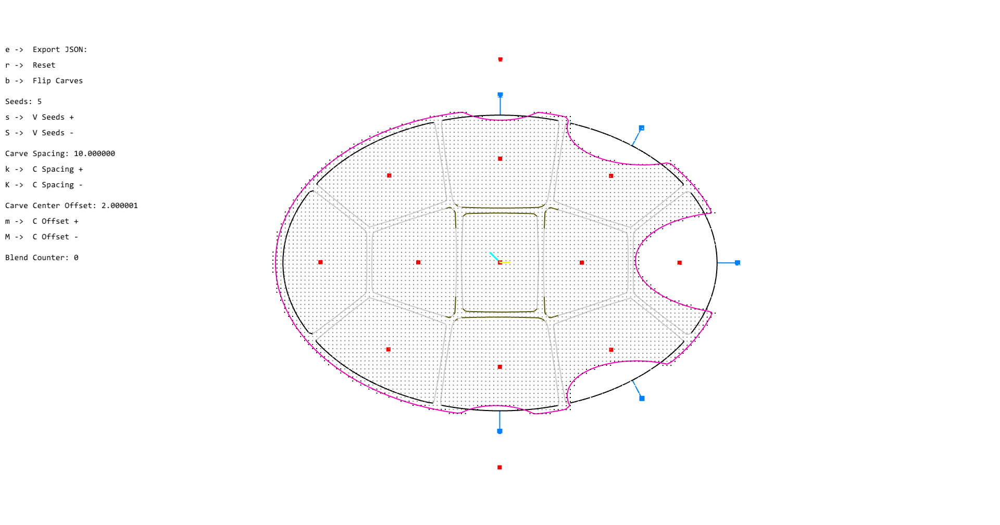

# SDF zSpace_Alice2

*Alice2 utilities and user sketches for generating, visualizing, and exporting signed distance fields (SDF). Produces DF25‑compliant `sdf.json` + `sdf.raw`/`sdf.npy` from geometry or from GH scalar fields.*

**Targets**: Windows 10/11 (x64), Z‑up.  
**Runtime DLLs**: included with **Alice2** (OpenGL/GLFW/GLEW/stb, plus project DLLs).  
**Related**: Step 1 — `Scalar_Field_GH` (Grasshopper export of `data_field.json`).

---

## Table of Contents


1.[Introduction](#introduction)

2.[Architecture Overview](#architecture-overview)

3.[Core Components](#core-components)
  
4.[Scalar Field– Educational Series](./README_ScalarField_Educational_Series.md)

5.[User Sketch](./README.md)
   
5.[Example Workflow](#example-workflow)

6.[Export Utilities](#export-utilities)


---

## Introduction

`SDF_Alice2` is a comprehensive C++ framework for creating, manipulating, and visualizing signed distance fields (SDFs) within the Alice2 3D scene viewer. It transforms geometric primitives, procedural shapes, and external data into **DF25 SDF** format suitable for downstream machine learning and AI rendering pipelines.

**Key Capabilities:**
- **Real-time SDF Generation**: Dynamic scalar field creation from circles, rectangles, polygons, and Voronoi diagrams
- **Advanced Boolean Operations**: Union, intersection, subtraction, and smooth blending with configurable parameters
- **Interactive Visualization**: Live preview with contour extraction, gradient visualization, and 3D rendering
- **Export Pipeline**: Direct DF25 export (`sdf.json` + `sdf.raw`) or conversion from Grasshopper JSON
- **Educational Framework**: Progressive learning series from basic concepts to advanced techniques

> **Coordinate System**: Z‑up, consistent with zSpace framework conventions.

---

## Architecture Overview

Alice2 follows a modular architecture designed for extensibility and educational use:

```
alice2/
├── src/                    # Core engine (C++20)
│   ├── core/              # Application, Scene, Renderer, Camera
│   ├── objects/           # Scene objects and primitives
│   ├── input/             # Input handling and camera control
│   ├── sketches/          # Sketch management system
│   └── utils/             # Math utilities and OpenGL helpers
├── userSrc/               # User sketches and examples
│   ├── scalarField.h      # Core ScalarField2D implementation
│   ├── sketch_*.cpp       # Educational and utility sketches
│   └── README_*.md        # Detailed documentation
├── depends/               # Third-party libraries
│   ├── eigen/             # Linear algebra (header-only)
│   ├── nlohmann/          # JSON I/O (header-only)
│   ├── glfw/              # Window management
│   ├── glew/              # OpenGL extensions
│   └── stb/               # Image utilities
└── build/                 # CMake-generated build files
```

---

## Core Components

### ScalarField2D API

The `scalarField.h` header provides a modern, RAII-compliant **ScalarField2D** class that serves as the foundation for all SDF operations:

#### **Primitive Operations**
- **`apply_scalar_circle(center, radius)`** — Circular SDF with negative inside values
- **`apply_scalar_rect(center, half_size, angle)`** — Oriented rectangular SDF
- **`apply_scalar_line(start, end, thickness)`** — Capsule/line SDF
- **`apply_scalar_polygon(vertices)`** — Arbitrary polygon SDF
- **`apply_scalar_voronoi(sites)`** — Voronoi edge distance field
- **`apply_scalar_ellipse(center, rx, ry, rotation)`** — Elliptical SDF

#### **Boolean Operations**
```cpp
// Hard boolean operations
void boolean_union(const ScalarField2D& other);
void boolean_intersect(const ScalarField2D& other);
void boolean_subtract(const ScalarField2D& other);

// Smooth blending operations
void boolean_smin(const ScalarField2D& other, float smoothing = 1.0f);
void boolean_smin_weighted(const ScalarField2D& other, 
                          float smoothing = 1.0f, float weight = 0.5f);
```

#### **Analysis & Visualization**
- **`get_contours(threshold)`** — Marching squares contour extraction
- **`get_gradient()`** — Finite difference gradient computation
- **`draw_points(renderer, step)`** — Jet color-mapped field visualization
- **`draw_values(renderer, step)`** — 3D text value display

> **Sign Convention**: Inside < 0, Outside > 0 (consistent throughout the API)

### Sketch System

Alice2 implements a sophisticated sketch management system that enables rapid prototyping and educational exploration:

#### **Sketch Lifecycle**
```cpp
class ISketch {
    virtual void setup() = 0;           // Initialization
    virtual void update(float deltaTime) = 0;  // Animation loop
    virtual void draw(Renderer& renderer, Camera& camera) = 0;
    
    // Metadata for UI integration
    virtual std::string getName() const = 0;
    virtual std::string getDescription() const = 0;
    virtual std::string getAuthor() const = 0;
};
```

#### **Hot Reload Support**
- Automatic sketch discovery in `userSrc/` directory
- Runtime sketch switching without application restart
- Dynamic library loading for compiled sketches

### Rendering Pipeline

Built on OpenGL with modern C++ abstractions:
- **Scene Graph**: Hierarchical object management
- **Camera System**: Perspective/orthographic with controller support
- **Renderer**: OpenGL state management and primitive drawing
- **Input Handling**: GLFW-based input with camera control integration


---

[Scalar Field– Educational Series](./README_ScalarField_Educational_Series.md)

---


[User Sketch](./README.md)


---

## Example Workflow

### Complete SDF Generation Pipeline

```cpp
// 1. Create field with desired resolution
ScalarField2D field(Vec3(-100, -100, 0), Vec3(100, 100, 0), 256, 256);

// 2. Apply geometric primitives
field.apply_scalar_rect(Vec3(0, 0, 0), Vec3(50, 30, 0), 0.0f);
field.apply_scalar_circle(Vec3(20, 15, 0), 25.0f);

// 3. Perform boolean operations
ScalarField2D circle2(Vec3(-20, -15, 0), Vec3(100, 100, 0), 256, 256);
circle2.apply_scalar_circle(Vec3(-20, -15, 0), 20.0f);
field.boolean_smin(circle2, 2.0f);

// 4. Extract contours for visualization
ContourData contours = field.get_contours(0.0f);

// 5. Visualize and analyze the field
// The field is now ready for further processing or visualization
```

### Integration with Machine Learning Pipeline
1. **Generate SDF**: Use Alice2 for interactive design and validation
2. **Process Field**: Apply boolean operations and blending as needed
3. **Train Model**: Use the generated SDF data for ML model training
4. **Inference**: Generate new SDFs from learned representations
5. **Visualization**: Return to Alice2 for result validation

### Advanced Example

#### **Voronoi SDF** (`sketch_voronoi.cpp`)
Complex procedural generation using Voronoi diagrams:
- Multi-field composition (facade, core, base)
- Dynamic site generation with proximity constraints
- Real-time field combination and visualization
- Building massing and urban planning applications


*Figure 1: Voronoi SDF visualization showing multi-field composition and dynamic generation*


*Figure 2: Ellipse and rectangle dynamic generation*

---

### Export Utilities

#### **JSON Export Utilities**

The framework provides JSON export capabilities for SDF data using the integrated nlohmann/json library:

```cpp
#include <nlohmann/json.hpp>
#include <fstream>
using json = nlohmann::json;

void exportSdfToJson(const ScalarField2D& field, const std::string& filename) {
    // Extract field data
    auto [nx, ny] = field.get_resolution();
    auto [bbmin, bbmax] = field.get_bounds();
    std::vector<float> values = field.get_values();
    
    // Create JSON structure
    json j = {
        {"metadata", {
            {"name", "alice2_sdf_export"},
            {"version", "1.0"},
            {"timestamp", "2024-01-01T00:00:00Z"},
            {"source", "alice2:ScalarField2D"}
        }},
        {"grid", {
            {"resolution", {nx, ny}},
            {"bounds", {
                {"min", {bbmin.x, bbmin.y, bbmin.z}},
                {"max", {bbmax.x, bbmax.y, bbmax.z}}
            }}
        }},
        {"data", {
            {"values", values},
            {"sign_convention", "inside<0, outside>0"},
            {"data_type", "float32"}
        }}
    };
    
    // Write to file
    std::ofstream file(filename);
    file << j.dump(2);
}

```


